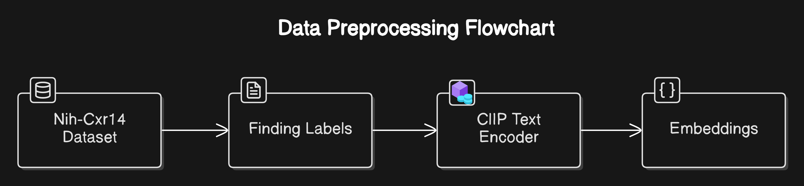
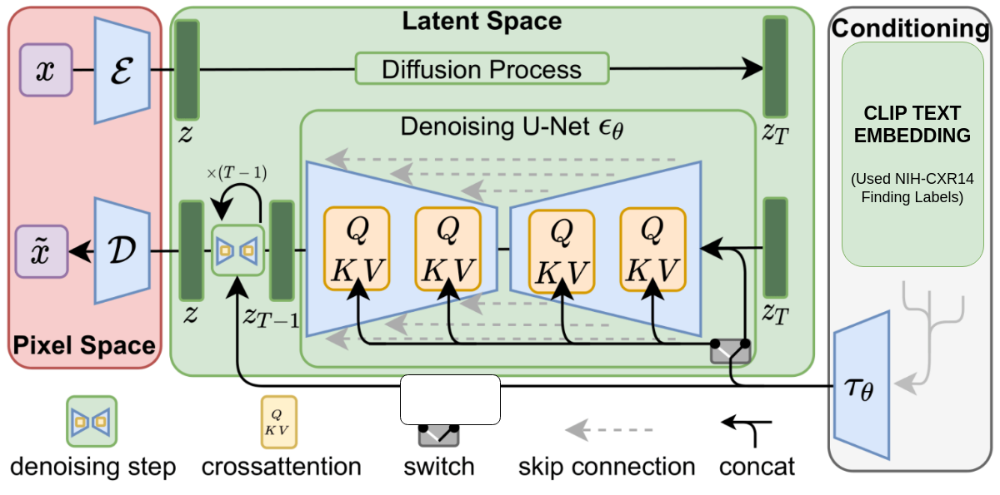
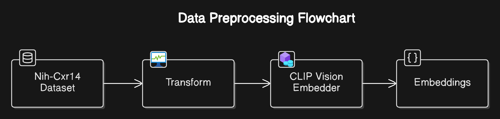
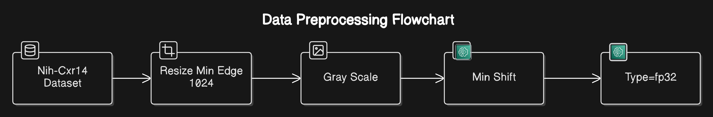
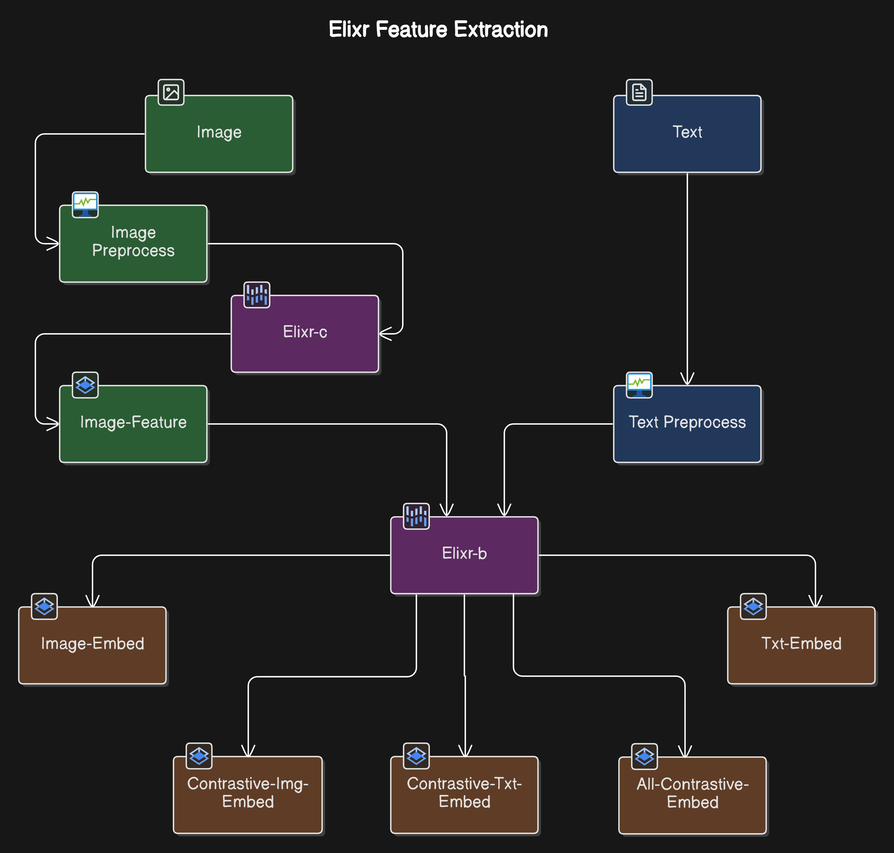
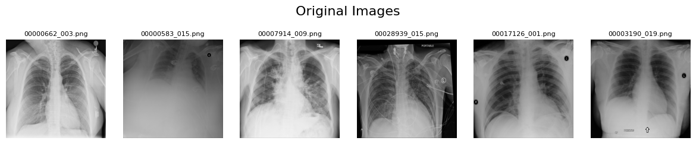
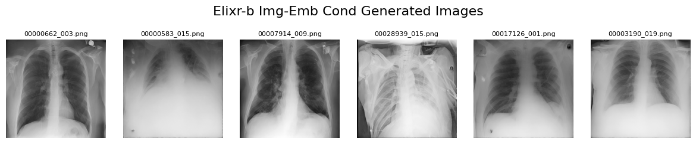
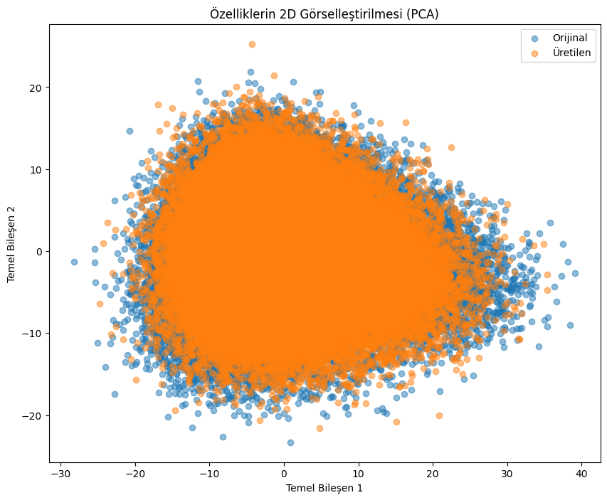

# CXR-Diffusion: Synthetic Chest X-Ray Generation Using Multiple Conditioning Approaches

## 1. Project Overview

CXR-Diffusion is a research project investigating the generation of synthetic chest X-ray (CXR) images using diffusion models. This project explores and compares various conditioning methods to improve the quality, diversity, and clinical relevance of the generated images. The goal is to advance the capabilities of generative models in medical imaging, potentially aiding in data augmentation, medical education, and diagnostic tool development.

<br><br>

## 2. Key Objectives

* **Generate High-Quality Synthetic CXR Images:** Develop and refine diffusion model architectures to produce realistic and clinically plausible CXR images.
* **Compare Conditioning Approaches:** Evaluate the effectiveness of different conditioning techniques, including text-based, image-based, and feature-based conditioning.
* **Assess Image Quality and Clinical Relevance:** Employ quantitative metrics and qualitative assessments to evaluate the fidelity and clinical accuracy of the generated images.
* **Provide Insights for Medical Image Synthesis:** Contribute to the understanding of effective methods for medical image synthesis using diffusion models.

<br><br>

## 3. Conditioning Approaches

This project explores three primary conditioning approaches:

### 3.1. Text-Based Conditioning (CLIP Text Encoder)

* Utilizes the text encoder component of the CLIP (Contrastive Language–Image Pre-training) model to guide image generation based on textual descriptions.
* Textual descriptions are derived from the "finding labels" field of the NIH CXR14 dataset, allowing for generation based on specific clinical findings.
* **Process:** Text descriptions are encoded into embeddings using CLIP's text encoder, and these embeddings are used to condition the diffusion process.

    ```
    CLIP Text Preprocessing: Text -> CLIP Text Encoder -> Text Embeddings
    CLIP Text Conditioned Training: Text Embeddings + (Image * Noise) -> Diffusion Model -> CXR Image
    ```

    
    

<br><br><br><br>

### 3.2. Image-Based Conditioning (CLIP Vision Encoder)

* Leverages the vision encoder of the CLIP model to guide image generation based on reference CXR images.
* Enables reference-based image synthesis, allowing for variations and modifications of existing images.
* **Process:** Reference CXR images are encoded into embeddings using CLIP's vision encoder, and these embeddings are used to condition the diffusion process.

    ```
    CLIP Vision Preprocessing: Image -> CLIP Vision Encoder -> Image Embeddings
    CLIP Vision Conditioned Training: Image Embeddings + (Image *Noise) -> Diffusion Model -> CXR Image
    ```

    
    

<br><br><br><br>

### 3.3. Feature-Based Conditioning (ELIXR Embeddings)

* Employs pre-extracted feature embeddings from the ELIXR-B model to condition the diffusion process.
* ELIXR-B provides rich, high-level feature representations of CXR images, capturing complex anatomical and pathological information.
* **Process:** CXR images are processed by the ELIXR-B model to extract feature embeddings, and these embeddings are used to condition the diffusion process.

    ```
    ELIXR Feature Extraction: Image -> ELIXR-C Model -> Feature Embeddings -> ELIXR-B Model -> Img_emb
    ELIXR Conditioned Training: Img_emb + (Image * Noise) -> Diffusion Model -> CXR Image
    ```

    
    
    

<br><br><br><br>

## 4. Methodology

* Implementation of diffusion models (e.g., DDPM, DDIM) adapted for CXR image synthesis.
* Comparative analysis of the three conditioning approaches described above.
* Quantitative evaluation using metrics such as Fréchet Inception Distance (FID) and qualitative assessment by medical experts.
* Principal Component Analysis (PCA) to visualize the distribution of generated and real data in latent space.

### 4.1. Dataset

* **NIH Chest X-rays Dataset:** Used for training and evaluation. Access: [NIH Chest X-rays](https://www.kaggle.com/datasets/nih-chest-xrays/data)
    * **Preprocessing:** Images are resized to 512x512, converted to RGB, and normalized to [-1, 1].
* **NIH CXR14 ELIXR Embeddings:** Pre-extracted ELIXR-B feature embeddings. Access: [nih-cxr14-elixr](https://huggingface.co/datasets/Yasintuncer/nih-cxr14-elixr)
* **Filtered Dataset:** A subset of the NIH CXR14 dataset, defined by `data/filtered_nihcxr14.csv`, containing `48311` images used for training.

    

<br><br><br><br>

### 4.2. Hyperparameters

| Parameter | CLIP Text2Image | CLIP Vision2Image | ELIXR ImgEmb2Image |
| :-------- | :-------------- | :---------------- | :----------------- |
| Batch Size | 256 | 256 | 256 |
| Channels | 3 | 3 | 3 |
| Embedding Shape | (num_tokens, 768) | (1, 768) | (32, 768) |
| Epochs | 20 | 20 | 20 |
| Learning Rate | 1e-4 | 1e-4 | 1e-5 |

* **Effective Batch Size:** Achieved using gradient accumulation (e.g., 4 x 64).
* **Adaptive Learning Rate:** Employed to optimize training.

<br><br><br><br>

## 5. Results

### 5.1. Sample Outputs

* **CLIP Text Outputs:**

    
    

* **CLIP Vision Outputs:**

    
    

* **ELIXR Img-Emb Outputs:**

    
    

<br><br>

### 5.2. FID Results

| FID | CLIP Text2Image | CLIP Vision2Image | ELIXR ImgEmb2Image |
| :-- | :-------------- | :---------------- | :----------------- |
| Score | 26.183 | 21.831 | 24.070 |

<br><br>

### 5.3. PCA Analysis

* **CLIP Text Outputs PCA:**

    

* **CLIP Vision Outputs PCA:**

    

* **ELIXR Img-Emb Outputs PCA:**

    

## Acknowledgments

* National Institutes of Health (NIH) for the NIH Chest X-rays dataset.
* Researchers and contributors of the CLIP model.
* Researchers and contributors of the [ELIXR](https://pubs.rsna.org/doi/10.1148/radiol.212482) models.

## License

* NIH Chest X-rays: [Kaggle Dataset License](https://www.kaggle.com/datasets/nih-chest-xrays/data)
* CLIP and ELIXR model licenses should be consulted from their respective sources.