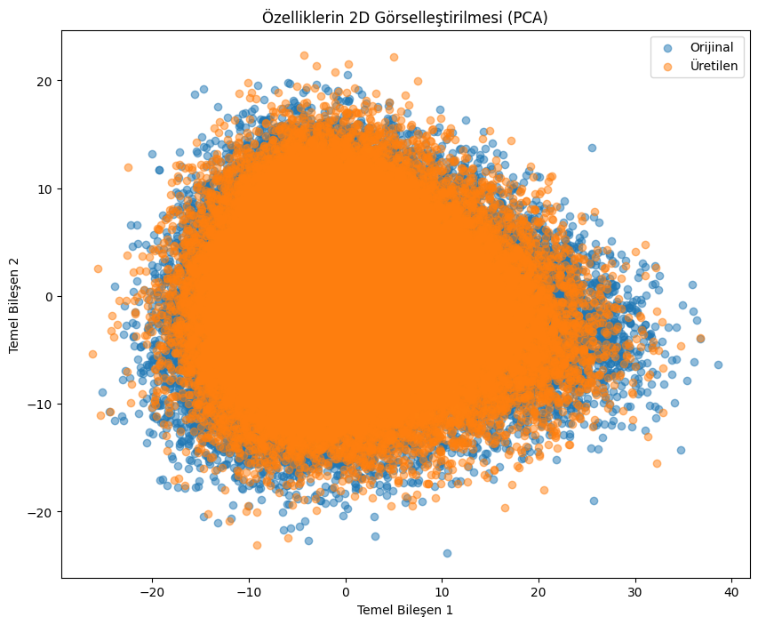

# CXR-Diffusion: Çoklu Koşullandırma Yaklaşımları Kullanarak Sentetik Göğüs Röntgeni Üretimi

## 1. Proje Genel Bakışı

CXR-Diffusion, difüzyon modelleri kullanarak yüksek kaliteli sentetik göğüs röntgeni (CXR) görüntüleri üretmeye odaklanan bir araştırma projesidir. Proje, üretilen görüntülerin kalitesini, çeşitliliğini ve klinik uygunluğunu artırmak için çeşitli koşullandırma yöntemlerini keşfeder ve karşılaştırır. Amaç, tıbbi görüntülemede üretken modellerin yeteneklerini geliştirmek, potansiyel olarak veri artırma, tıp eğitimi ve tanı aracı geliştirmeye yardımcı olmaktır.

<br><br>

## 2. Temel Hedefler

* **Yüksek Kaliteli Sentetik CXR Görüntüleri Üretmek:** Gerçekçi ve klinik olarak makul CXR görüntüleri üretmek için difüzyon modeli mimarilerini geliştirmek ve iyileştirmek.
* **Koşullandırma Yaklaşımlarını Karşılaştırmak:** Metin tabanlı, görüntü tabanlı ve özellik tabanlı koşullandırma dahil olmak üzere farklı koşullandırma tekniklerinin etkinliğini değerlendirmek.
* **Görüntü Kalitesini ve Klinik Uygunluğunu Değerlendirmek:** Üretilen görüntülerin doğruluğunu ve klinik uygunluğunu değerlendirmek için nicel metrikler ve nitel değerlendirmeler kullanmak.
* **Tıbbi Görüntü Sentezi İçin İçgörüler Sağlamak:** Difüzyon modelleri kullanarak tıbbi görüntü sentezi için etkili yöntemlerin anlaşılmasına katkıda bulunmak.

<br><br>

## 3. Koşullandırma Yaklaşımları

Bu proje üç temel koşullandırma yaklaşımını keşfeder:

### 3.1. Metin Tabanlı Koşullandırma (CLIP Metin Kodlayıcı)

* Metin açıklamalarına dayalı görüntü üretimini yönlendirmek için CLIP (Karşılaştırmalı Dil-Görüntü Ön Eğitimi) modelinin metin kodlayıcı bileşenini kullanır.
* Metin açıklamaları, belirli klinik bulgulara dayalı üretime izin veren NIH CXR14 veri kümesinin "bulgu etiketleri" alanından elde edilir.
* **Süreç:** Metin açıklamaları, CLIP'in metin kodlayıcısı kullanılarak gömülere kodlanır ve bu gömüler, difüzyon sürecini koşullandırmak için kullanılır.

    ```
    CLIP Text Preprocessing: Text -> CLIP Text Encoder -> Text Embeddings
    CLIP Text Conditioned Training: Text Embeddings + (Image * Noise) -> Diffusion Model -> CXR Image
    ```

    
    

<br><br><br><br>

### 3.2. Görüntü Tabanlı Koşullandırma (CLIP Görsel Kodlayıcı)

* Referans CXR görüntülerine dayalı görüntü üretimini yönlendirmek için CLIP modelinin görsel kodlayıcısını kullanır.
* Mevcut görüntülerin varyasyonlarına ve modifikasyonlarına izin veren referans tabanlı görüntü sentezini etkinleştirir.
* **Süreç:** Referans CXR görüntüleri, CLIP'in görsel kodlayıcısı kullanılarak gömülere kodlanır ve bu gömüler, difüzyon sürecini koşullandırmak için kullanılır.

    ```
    CLIP Vision Preprocessing: Image -> CLIP Vision Encoder -> Image Embeddings
    CLIP Vision Conditioned Training: Image Embeddings + (Image *Noise) -> Diffusion Model -> CXR Image
    ```

    
    

<br><br><br><br>

### 3.3. Özellik Tabanlı Koşullandırma (ELIXR Gömüleri)

* Difüzyon sürecini koşullandırmak için ELIXR-B modelinden önceden çıkarılmış özellik gömülerini kullanır.
* ELIXR-B, karmaşık anatomik ve patolojik bilgileri yakalayan CXR görüntülerinin zengin, üst düzey özellik temsillerini sağlar.
* **Süreç:** CXR görüntüleri, özellik gömülerini çıkarmak için ELIXR-B modeli tarafından işlenir ve bu gömüler, difüzyon sürecini koşullandırmak için kullanılır.

    ```
    ELIXR Feature Extraction: Image -> ELIXR-C Model -> Feature Embeddings -> ELIXR-B Model -> Img_emb
    ELIXR Conditioned Training: Img_emb + (Image * Noise) -> Diffusion Model -> CXR Image
    ```

    
    
    

<br><br><br><br>


<br><br><br><br>


<br><br><br><br>

## 4. Metodoloji

* CXR görüntü sentezi için uyarlanmış difüzyon modellerinin (örn. DDPM, DDIM) uygulanması.
* Yukarıda açıklanan üç koşullandırma yaklaşımının karşılaştırmalı analizi.
* Fréchet Başlangıç Mesafesi (FID) gibi metrikler kullanılarak nicel değerlendirme ve tıp uzmanları tarafından nitel değerlendirme.
* Üretilen ve gerçek verilerin latent uzaydaki dağılımını görselleştirmek için Temel Bileşen Analizi (PCA).

### 4.1. Veri Kümesi

* **NIH Göğüs Röntgeni Veri Kümesi:** Eğitim ve değerlendirme için kullanılır. Erişim: [NIH Göğüs Röntgeni](https://www.kaggle.com/datasets/nih-chest-xrays/data)
    * **Ön İşleme:** Görüntüler 512x512 boyutuna yeniden boyutlandırılır, RGB'ye dönüştürülür ve [-1, 1]'e normalleştirilir.
* **NIH CXR14 ELIXR Gömüleri:** Önceden çıkarılmış ELIXR-B özellik gömüleri. Erişim: [nih-cxr14-elixr](https://huggingface.co/datasets/Yasintuncer/nih-cxr14-elixr)
* **Filtrelenmiş Veri Kümesi:** Eğitim için kullanılan `48311` görüntü içeren `data/filtered_nihcxr14.csv` ile tanımlanan NIH CXR14 veri kümesinin bir alt kümesi.

    

<br><br><br><br>

### 4.2. Hiperparametreler

| Parametre | CLIP Metin2Görüntü | CLIP Görsel2Görüntü | ELIXR Gömü2Görüntü |
| :-------- | :----------------- | :------------------ | :------------------- |
| Yığın Boyutu | 256 | 256 | 256 |
| Kanallar | 3 | 3 | 3 |
| Gömü Şekli | (token_sayısı, 768) | (1, 768) | (32, 768) |
| Dönemler | 20 | 20 | 20 |
| Öğrenme Oranı | 1e-4 | 1e-4 | 1e-5 |

* **Etkili Yığın Boyutu:** Gradyan birikimi kullanılarak elde edilir (örn. 4 x 64).
* **Uyarlanabilir Öğrenme Oranı:** Eğitimi optimize etmek için kullanılır.

<br><br><br><br>

## 5. Sonuçlar

### 5.1. Örnek Çıktılar

* **CLIP Metin Çıktıları:**

    
    

* **CLIP Görsel Çıktıları:**

    
    

* **ELIXR Gömü-Görüntü Çıktıları:**

    
    

<br><br>

### 5.2. FID Sonuçları

| FID | CLIP Metin2Görüntü | CLIP Görsel2Görüntü | ELIXR Gömü2Görüntü |
| :-- | :----------------- | :------------------ | :------------------- |
| Skor | 26.183 | 21.831 | 24.070 |

<br><br>

### 5.3. PCA Analizi

* **CLIP Metin Çıktıları PCA:**

    

* **CLIP Görsel Çıktıları PCA:**

    

* **ELIXR Gömü-Görüntü Çıktıları PCA:**

    

## Teşekkürler

* NIH Göğüs Röntgeni veri kümesi için Ulusal Sağlık Enstitüleri'ne (NIH).
* CLIP modelinin araştırmacılarına ve katkıda bulunanlarına.
* [ELIXR](https://pubs.rsna.org/doi/10.1148/radiol.212482) modellerinin araştırmacılarına ve katkıda bulunanlarına.

## Lisans

* NIH Göğüs Röntgeni: [Kaggle Veri Kümesi Lisansı](https://www.kaggle.com/datasets/nih-chest-xrays/data)
* CLIP ve ELIXR model lisansları, ilgili kaynaklarından kontrol edilmelidir.